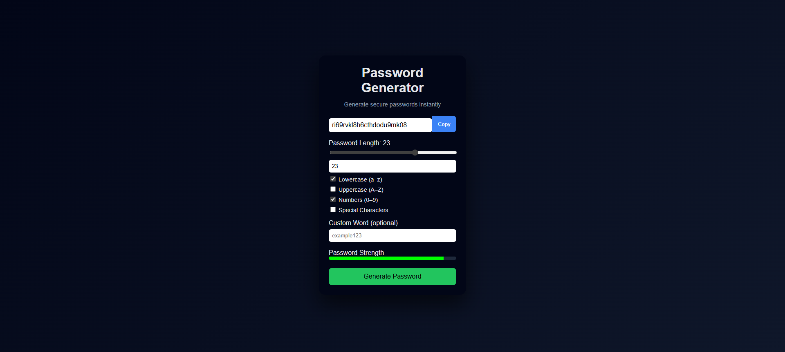

# 🔐 Password Generator Web Application

A full-stack **Password Generator** web application built using **Java (Spring Boot)** for backend logic and **HTML, CSS, JavaScript** for the frontend.

The project follows **clean separation of concerns**:
- Frontend handles UI and user interaction
- Backend handles secure password generation only

---
## 📸 Screenshot

## 🚀 Key Features

- Configurable password length (slider + input)
- Character selection:
  - Lowercase
  - Uppercase
  - Numbers
  - Special characters
- Optional custom word support
- Password strength indicator
- Copy-to-clipboard functionality
- Secure password generation using Java

---

## 🧠 Architecture Overview

Frontend (HTML, CSS, JavaScript)
        |
        |  POST /generate (JSON)
        v
Backend (Java - Spring Boot)
        |
        |  Generated password
        v
Frontend UI

---

## 🛠 Tech Stack

### Frontend
- HTML5
- CSS3
- JavaScript (Fetch API)

### Backend
- Java
- Spring Boot
- Maven

---

## 📁 Project Structure

password-generator/
├── backend/
│   ├── pom.xml
│   └── src/main/java/com/example/passwordgenerator/
│       ├── PasswordgeneratorApplication.java
│       ├── controller/
│       ├── service/
│       └── model/
└── frontend/
    ├── index.html
    ├── style.css
    └── script.js

---

## ▶️ How to Run the Project

### Backend
mvn spring-boot:run

Runs on:
http://localhost:8080

### Frontend
python -m http.server 5500

Open:
http://localhost:5500

---

## 🔐 API Endpoint

POST /generate

Request Body (JSON):
{
  "length": 12,
  "lowercase": true,
  "uppercase": true,
  "numbers": true,
  "special": true,
  "customWord": "example"
}

Response:
Generated password (string)

---

## 📌 What This Project Demonstrates

- RESTful API development using Spring Boot
- Secure password generation using SecureRandom
- Clean backend architecture (Controller–Service–Model)
- Frontend ↔ Backend communication using Fetch API
- Proper handling of CORS
- Real-world project setup using Maven
- UI/UX design without frontend frameworks

---

## 👨‍💻 Author

Developed as a full-stack practice project focusing on backend architecture,
API design, and frontend integration.
